# Introduction to Kafka with Spring Boot

This repository contains the code to support the [Introduction to Kafka with Spring Boot](https://www.udemy.com/course/introduction-to-kafka-with-spring-boot/?referralCode=15118530CA63AD1AF16D) online course.

The application code is for a message driven service which utilises Kafka and Spring Boot 3.

The code in this repository is used to help students learn how to produce and consume messages in Java using Spring Kafka and Spring Boot 3.
The course provides step by step instructions and detailed explanations for students to build up the code themselves.
This repository provides the code to support the course broken down section by section using branches, allowing students to
compare and contrast the code they create with the lesson code in the branches.

As you work through the course, please feel free to fork this repository to your own GitHub repo. Most lectures contain links
to source code changes. If you encounter a problem you can compare your code to the lecture code. See the [How to Compare Branches](https://github.com/lydtechconsulting/introduction-to-kafka-with-spring-boot/wiki#how-to-compare-branches) section in the Wiki.

## Introduction to Kafka with Spring Boot Course Wiki
Plenty of useful information about your Introduction to Kafka with Spring Boot course can be found in the [Wiki](https://github.com/lydtechconsulting/introduction-to-kafka-with-spring-boot/wiki).

## Getting Your Development Environment Setup
### Recommended Versions
| Recommended                | Reference                                                             | Notes                                                                                                                                                                                                                                                          |
|----------------------------|-----------------------------------------------------------------------|----------------------------------------------------------------------------------------------------------------------------------------------------------------------------------------------------------------------------------------------------------------|
| Apache Kafka 3.3 or higher | [Download](https://kafka.apache.org/downloads)                        |                                                                                                                                                                                    |
| Oracle Java 17 JDK         | [Download](https://www.oracle.com/java/technologies/downloads/#java17) | Java 17 or higher. We recommend using the most recent LTS (Long-Term Support) release                                                                                                                                                                          |
| IntelliJ 2022 or higher    | [Download](https://www.jetbrains.com/idea/download/)                  | Ultimate Edition recommended. Students can get a free 120 trial license, courtesy of the Spring Framework Guru, [here](https://github.com/springframeworkguru/spring5webapp/wiki/Which-IDE-to-Use%3F#how-do-i-get-the-free-120-day-trial-to-intellij-ultimate) |
| Maven 3.6 or higher        | [Download](https://maven.apache.org/download.cgi)                     | [Installation Instructions](https://maven.apache.org/install.html)                                                                                                                                                                                             |                                                                                                                 | **Note:** Use Version 5 or higher if using Java 11                                                                                                                                                                     |
| Git 2.39 or higher         | [Download](https://git-scm.com/downloads)                             |                                                                                                                                                                                                                                                                | 
| Git GUI Clients            | [Download](https://git-scm.com/downloads/guis)                        | Not required. But can be helpful if new to Git. SourceTree is a good option for Mac and Windows users.                                                                                                                                                         |

## Connect with the team at Lydtech Consulting
* Visit us at [lydtechconsulting.com](https://www.lydtechconsulting.com/)
* Visit our [LinkedIn](https://www.linkedin.com/company/lydtech-consulting) page

# 5. Coding Kafka with Spirng Boot

## 1. Section Introduction
---

- Service Overview
    - Repeatable pattern
    - Common EDA implementation
- Tech List
    - Spring Boot 3
    - Spring Kafka
    - Java 17
    - Maven 3.6+
    - Lombok
    - Kafka 3.3+
        - Kraft O, Zookeeper X


## 2. Creating The Project - Spring Initializr
---

https://github.com/lydtechconsulting/introduction-to-kafka-with-spring-boot


## 3. The Consumer
---

- Add a consumer to the Dispatch Service
- Spring annotation
    - `@KafkaListener`
    - `@Component`
    - `@Service`
- Application properties - Deserialization
- Unit tests
    - JUnit, Mockito
- Command line invocation

Console Producer -`order.created`-> Dispatch

구현한 Consumer 서버를 구동시키고 카프카 테스트 메세지 전송
```bash
$ bin/kafka-console-producer.sh --topic order.created --bootstrap-server localhost:9092

> test message
```

Consumer 메세지 응답
```bash
2023-11-23T22:01:58.204+09:00  INFO 62170 --- [merClient-0-C-1] d.l.d.handler.OrderCreatedHandler        : Received message: payload: test-message
2023-11-23T22:02:07.685+09:00  INFO 62170 --- [merClient-0-C-1] d.l.d.handler.OrderCreatedHandler        : Received message: payload: test-message2
```

### Recap
summing up

- Added a consumer with `@KafkaListener`
- Specified the deserialization configuration
- verified with unit tests
- Ran the end to end flow


## 4. JSON Deserializer
---

- Change the Order Created event type to JSON
- Create a POJO to represent the event
- Update deserialization configuration in application.properties
- Send a JSON event from the command line


Console producer -`order.created`(JSON)-> Dispatch

카프카 JSON 메세지 전송
```bash
$ bin/kafka-console-producer.sh --topic order.created --bootstrap-server localhost:9092

>{"orderId": "7c4d32e9-4999-434b-953a-9467f09b023f","item":"item-1"}
```

Consumer JSON 메세지 응답
```bash
2023-11-23T23:06:37.135+09:00  INFO 62978 --- [merClient-0-C-1] d.l.d.handler.OrderCreatedHandler        : Received message: payload: OrderCreated(orderId=7c4d32e9-4999-434b-953a-9467f09b023f, item=item-1)
```

### Recap
summing up

- Added a class of type 'OrderCreated' to represent the event
- Updated the deserialization configuration
- Ran the end to end flow


## 5. Deserializer Error Handling
---

- Demonstrate deserialization errors
- Handling deserialization errors
- Use Spring Kafka's ErrorHandlingDeserializer

Console producer -`order.created`(Invalid JSON)-> Dispatch

잘못된 형식의 메세지를 전송하여 Consumer 역직렬화시 오류를 발생시킴
```bash
bin/kafka-console-producer.sh --topic order.created --bootstrap-server localhost:9092

>{"orderId":"123","item":"invalid-1"}
>{"orderId": "7c4d32e9-4999-434b-953a-9467f09b023f","item":"item-2"}
>{"orderId":"123","item":"invalid-2"}
```

조치 후 Consumer에서 잘못된 형식의 메세지는 읽기에 실패하지만 다음 메세지를 문제없이 계속 받을 수 있음
### Recap
Summing up

- Demonstrated a deserialization error
- Updated the deserialization configuration
- Observed invalid event handling


## 6. Spring Bean Configuration
---

- Define configuration programmatically
  - KafkaListenerContainerFactory
  - ConsumerFactory
- Spring annotations
  - `@Configuration`
  - `@Bean`
  - `@ComponentScan`
  - `@Value`


카프카 메세지 전송 테스트
```bash
bin/kafka-console-producer.sh --topic order.created --bootstrap-server localhost:9092

>{"orderId": "7c4d32e9-4999-434b-953a-9467f09b023f","item":"item-3"}
```

Consumer 서버 로그
```bash
2023-11-24T17:18:17.661+09:00  INFO 69907 --- [merClient-0-C-1] d.l.d.handler.OrderCreatedHandler        : Received message: payload: OrderCreated(orderId=7c4d32e9-4999-434b-953a-9467f09b023f, item=item-3)
```

### Recap
Summing up

- Defined a Spring configuration class
- Configured our Kafka listener
- Verified via the command line


## 7. Create The Topics
---

자동 Topic 생성과 수동 Topic 생성 비교

- Automatic topic creation
  - Useful for local development & testing


### 자동 Topic 설정 기본값
- Broker config: `auto.create.topics`
  - Default: `true`
- Consumer config: `allow.auto.create.topics`
  - Default: `true`

### 권장 설정
- Manual topic creation (명령줄 도구를 통해 생성된 topic만 허용)
  - Best practice for Production (and remote environments)
  - 인증된 항목만 ACL을 사용하여 보호됨


## 8. Produce
---

- Send an outbound JSON event **OrderDispatched**
- Spring beans
  - `KafkaTemplate`
  - `ProducerFactory`

Console producer -`order.created`-> Dispatch -`order.dispatched`->

- Synchronous vs asynchronous send
- Unhappy path unit tests


### Rcap
Summing up

- DispatchService updated to send an OrderDispatched JSON event
- Used KafkaTemplate to send the event
- Added exception handling in the handler


## 9. Consume Using CLI
---

Consume the Outbound Message on the Command Line

- Run the end to end flow
- Send an inbound event with the console-producer
- Consume the outbound event with the console-consumer

Console producer -`order.created`-> Dispatch -`order.dispatched`-> Console consumer

카프카 서버 시작
```bash
$ bin/kafka-server-start.sh config/kraft/server.properties
```

카프카 Consumer 콘솔 실행 및 응답 확인
```bash
$ bin/kafka-console-consumer.sh --topic order.dispatched --bootstrap-server localhost:9092

{"orderId":"7c4d32e9-4999-434b-953a-9467f09b023f"}
```

스프링 부트 서버 기동 메세지 응답 확인
```bash
Received message: payload: OrderCreated(orderId=7c4d32e9-4999-434b-953a-9467f09b023f, item=item-4)
```

카프카 Producer 콘솔 실행 및 메세지 전송
```bash
$ bin/kafka-console-producer.sh --topic order.created --bootstrap-server localhost:9092

> {"orderId": "7c4d32e9-4999-434b-953a-9467f09b023f","item":"item-4"}
```

### Recap
Summing up

- Used the command line tools to produce and consume events
- Proved the full end to end flow works successfully


# 6. Assignment - Tracking Service

## Dispatch Tracking Service
---
- Dispatch Service
  - https://github.com/freelife1191/introduction-to-kafka-with-spring-boot/tree/07-assignment-consume-and-produce
- Traking Service
  - https://github.com/freelife1191/introduction-to-kafka-with-spring-boot-tracking-service/tree/01-assignment-consume-and-produce

이 과제에서는 'Tracking'이라는 새 서비스를 만들려고 합니다.

_추적 서비스는 dispatch.tracking_ 주제 의 이벤트를 사용하여 상태를 확인 하고 디스패치의 현재 상태를 반영하는 이벤트를 생성합니다.


### Dispatch Service
Dispatch Service to emit a DispatchPreparing event on a new topic named _dispatch.tracking_

The payload for the DispatchPreparing event should look like:

`orderId: UUID`


### Tracking Service
Create a new service named TrackingService.  Follow the same steps used to create the Dispatch Service.

The Tracking Service should consume events from the _dispatch.tracking_ topic and emit a TrackingStatusUpdated event on a new topic named _tracking.status_.

The payload for the TrackingStatusUpdated event should look like:

1. orderId: UUID
2. status: Status

The enum should only contain a single value 'PREPARING' at this time


### Testing
Changes to both services should have unit test coverage.

### 질문 정답
1. Did you first generate a skeletal project for the Tracking service which you then built out, and if so, how did you generate it?
  - Spring Initializr could be used to generate the skeletal project as a starting point for the development of the Tracking service

2. What Spring Kafka annotation did you use on the listen method on the Tracking service handler class for the DispatchPreparing event?
  - Spring Kafka's KafkaListener annotation should be added to mark the listen method as the target for the DispatchPreparing event

3. What class did you configure for the ConsumerFactory ConsumerConfig.VALUE_DESERIALIZER_CLASS_CONFIG and why?
  - By configuring the deserializer as the ErrorHandlingDeserializer, it allows Spring Kafka to cleanly handle errors arising from deserializing invalid JSON messages

4. What Spring Kafka class did you use to send out the TrackingStatusUpdated event?
  - Spring Kafka's KafkaTemplate provides send methods to produce messages to Kafka


# 7. Spring Boot Integration Test

## Section Introduction

- Integration Test Overview
- Implement an integration test

### Unit Test
- Unit Tests are good
  - Small
  - Quick / easy to code
  - Fast feedback
- Prove units of code

### Proving code unit integrations
- Integration Testing
  - Test flows
  - Application context
  - In-memory instances (DB, broker)
  - Fast feedback
  - Verify 3rd Party Integrations (e.g Kafka)

## Integration Test
Using Spring Boot Test for Integration testing


### Spring Boot Test

- Build a Spring Boot Test
  - `@SpringBootTest`
  - `@ActiveProfiles`
  - `@DirtiesContext`
  - `@Autowired`
  - `@EmbeddedKafka`

### Test Helpers & Profile

- JUnit & Awaitility
- `application-test.properties`
- `spring.embedded.kafka.brokers`

## Recap
Summing up

- Built an integration test with Spring Boot Test
- Used the embedded Kafka Broker
- Used Kafka Template to send messages
- Verified with two test consumers


## Section Introduction
---
## Consumer Groups
Parallel Processing

### In this section...
- Throughput
- Fault Tolerance
- Scaling
- Heartbeating
- Rebalancing

## Why Consumer Groups?
- Isolation or Parallelism
- Distinct Processing Logic
  - 
  - Separate event streams
  - 
- Throughput
  - Single Consumer
  - 
  - Multiplie Consumers
  - Parallel Processing
  - 
- Throughput & Scaling
  - 
  - Max active consumers = num of partitions
  - 
- Fault Tolerance
  - Heartbeat
  - Poll Interval
  - 
  - 
- Fault Tolerance & Rebalancing
  - New Consumer
  - Dead Consumer
  - Lost Consumer
  - 
  - 
- Rebalancing
  - Consumer Scaling
    - Starting/Stopping Consumers
  - Dead Consumer
  - Lost Consumer
  - 
### Summing up
- Distinct & Parallel Processing
- Fault Tolerance
- Scaling
- Rebalancing
  - Heartbeat
  - Polling Interval
  - Rebalancing Strategy
  - Pause in Processing


# 8. Multiple Instance & Consumer Groups

## Introduction to Consumer Group Exercises
---
Demonstrating the impact of Consumer Groups

- Shared Consumer Group
- Consumer Failover
- Duplicate Consumption

## Shared Consumer Group
---
Multiple consumers in the consumer group

### in this module...
- Run 2 instances of the application
- Unique application Id for each
  

- Shared group Id
- Single partition

```bash
bin/kafka-console-producer.sh --topic order.created --bootstrap-server localhost:9092
>{"orderId": "7c4d32e9-4999-434b-953a-9467f09b023f","item":"item-5"}
```

## Recap
Summing up

- Demonstrated shared consumer group behaviour
- Only one instance in a consumer group received the event


## Demo Consumer Failover
---
Fault tolerance with consumer failover

### in this module...
- Kill the assigned consumer
- Observe consumer group rebalance


## Recap
Summing up

- Demonstrated Consumer failover behaviour
- The second consumer instance is assigned the partition

## Duplicate Consumption
---
Multiple consumers in different consumer groups

### In this module...
- Run 2 instances of the application
- Different group Ids
- Both consumers assigned partition


## Recap
Summing up

- Demonstrated separate consumer group behaviour
- 별도의 소비자 그룹 동작 시연
- The instance in each consumer group received the event
-   각 소비자 그룹의 인스턴스가 이벤트를 수신했다

## Section Recap
---
## Consumer Group
Summing up

- Consumer groups are required for applications that need all of the messages from a topic
- 주제의 모든 메시지가 필요한 애플리케이션에는 소비자 그룹이 필요하다


# 9. Keys, Partitions & Ordering

Orderd Events

## Section Introduction
---
### Keys, Partitions, but mainly Ordering
in this section...

- What is Ordering
- Partitions revisited(파티션 재검토)
- What Disrupts Ordering?(주문을 방해하는 요인은 무엇?)
- How to Guarantee Ordering(주문 보장 방법)
- Keys

### What is Ordering?
> Putting things into their correct place following a given rule
> 주어진 규칙에 따라 물건을 올바른 위치에 놓기

### Partitions
- Topic comprises 1 or more Partitions(주제는 1개 이상의 파티션으로 구성)
- More partitions = more throughput
- More partitions = more overheads
- Messages are written to an individual partition(메시지는 개별 파티션에 기록)
- A partiton may have 0..1 consumers

###  What Breaks Ordering

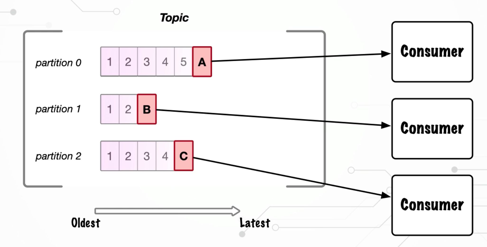

### How to Guarantee Ordering
- Keys
- Message Key = any type
- Producer hashes key to determine the target partition(생산자는 대상 파티션을 결정하기 위해 키를 해시)
  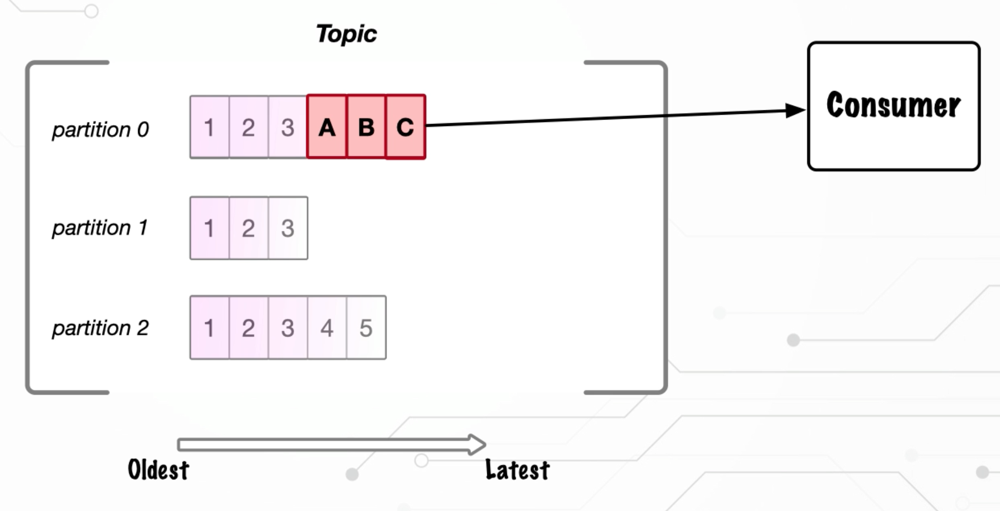


## Message Keys
---
Sending and receiving keyed messages

### Message Keys
In this module...

- `@Header`
  - `KafkaHeaders.RECEIVED_KEY`
  - `KafkaHeaders.RECEIVED_PARTITION`
- `@Payload`
  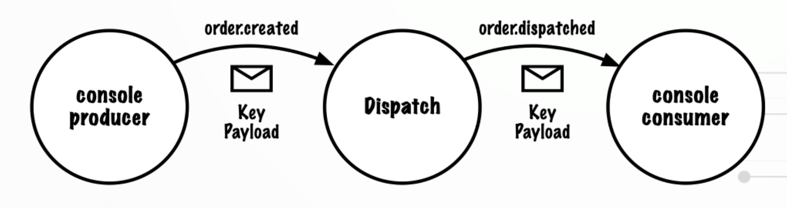

### Recap
Summing up

- Sent and received keyed messages
- Accessed key and partition headers


## Consuming Keyed Messages
---
The relationship between keyed messages and partitions

### Consuming Keyed Messages
In this modules...

- console-producer: include key
- console-consumer: print key
- Update partition count
- Run the end to end flow

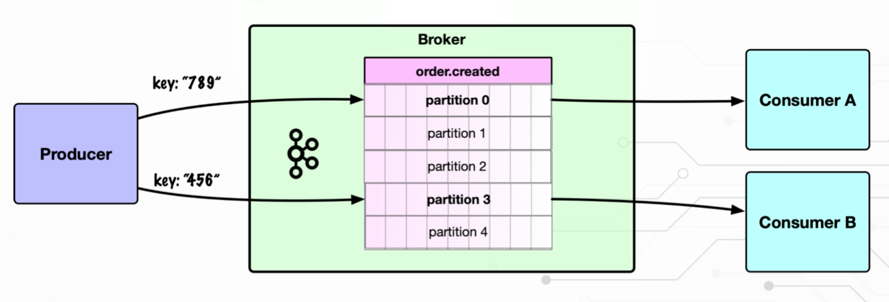


동일한 키로 생성된 메세지가 항상 동일한 파티션에 기록되는 지 테스트
```bash
$ bin/kafka-console-producer.sh --topic order.created --bootstrap-server localhost:9092 --property parse.key=true --property key.separator=:
# 메세지 전송시 키를 헤더로 추가
>"123":{"orderId": "7c4d32e9-4999-434b-953a-9467f09b0239","item":"item-9"}
```

컨슈머 명령도 수정
```bash
$ bin/kafka-console-consumer.sh --topic order.dispatched --bootstrap-server localhost:9092 --property parse.key=true --property key.separator=:
```

파티션수가 1인 것을 확인
단일 파티션의 인덱스는 0
```bash
$ bin/kafka-topics.sh --bootstrap-server localhost:9092 --describe --topic order.created

Topic: order.created    TopicId: u20yyFNUS4itknkaN32rbg PartitionCount: 1       ReplicationFactor: 1    Configs: 
        Topic: order.created    Partition: 0    Leader: 1       Replicas: 1     Isr: 1
```

파티션을 5개로 업데이트
```bash
$ bin/kafka-topics.sh --bootstrap-server localhost:9092 --alter --topic order.created --partitions 5
```

파티션이 5개로 업데이트 된 것을 확인
```bash
$ bin/kafka-topics.sh --bootstrap-server localhost:9092 --describe --topic order.created

Topic: order.created    TopicId: u20yyFNUS4itknkaN32rbg PartitionCount: 5       ReplicationFactor: 1    Configs: 
        Topic: order.created    Partition: 0    Leader: 1       Replicas: 1     Isr: 1
        Topic: order.created    Partition: 1    Leader: 1       Replicas: 1     Isr: 1
        Topic: order.created    Partition: 2    Leader: 1       Replicas: 1     Isr: 1
        Topic: order.created    Partition: 3    Leader: 1       Replicas: 1     Isr: 1
        Topic: order.created    Partition: 4    Leader: 1       Replicas: 1     Isr: 1
```

첫번째 어플리케이션에 5개의 파티션이 모두 할당되는 것을 확인
```bash
dispatch.order.created.consumer2: partitions assigned: [order.created-0, order.created-1, order.created-2, order.created-3, order.created-4]
```

두번째 어플리케이션을 추가하면 0,1,2 세개의 파티션이 할당되고
첫번째 어플리케이션에는 3,4 두개의 파티션이 재할당되는 것을 확인
```bash
# 두번째 어플리케이션 추가시 로그
dispatch.order.created.consumer2: partitions assigned: [order.created-0, order.created-1, order.created-2]

# 첫번째 어플리케이션 재할당 로그
dispatch.order.created.consumer2: partitions assigned: [order.created-3, order.created-4]
```

컨슈머 그룹 확인
```bash
$ bin/kafka-consumer-groups.sh --bootstrap-server localhost:9092 --list 

dispatch.order.created.consumer
dispatch.order.created.consumer2
```

컨슈머 그룹 상세정보 확인(파티션 할당 현황)
파티션 0에 10개의 레코드가 있음을 확인(단일 파티션만 있을 때 전송된 이벤트)
```bash
$ bin/kafka-consumer-groups.sh --bootstrap-server localhost:9092 --describe --group dispatch.order.created.consumer

GROUP                           TOPIC           PARTITION  CURRENT-OFFSET  LOG-END-OFFSET  LAG             CONSUMER-ID                                                                     HOST            CLIENT-ID
dispatch.order.created.consumer order.created   0          10              10              0               consumer-dispatch.order.created.consumer-1-67ca087c-f00e-4e91-99a4-cd22251c6956 /172.18.0.1     consumer-dispatch.order.created.consumer-1
dispatch.order.created.consumer order.created   1          0               0               0               consumer-dispatch.order.created.consumer-1-67ca087c-f00e-4e91-99a4-cd22251c6956 /172.18.0.1     consumer-dispatch.order.created.consumer-1
dispatch.order.created.consumer order.created   2          0               0               0               consumer-dispatch.order.created.consumer-1-67ca087c-f00e-4e91-99a4-cd22251c6956 /172.18.0.1     consumer-dispatch.order.created.consumer-1
dispatch.order.created.consumer order.created   3          0               0               0               consumer-dispatch.order.created.consumer-1-a33a66fd-9f7c-478e-9ee3-ba95f433edb3 /172.18.0.1     consumer-dispatch.order.created.consumer-1
dispatch.order.created.consumer order.created   4          0               0               0               consumer-dispatch.order.created.consumer-1-a33a66fd-9f7c-478e-9ee3-ba95f433edb3 /172.18.0.1     consumer-dispatch.order.created.consumer-1
```

동일한 메세지 전송시 할당된 파티션의 어플리케이션에서만 수신이 되는 것을 확인
```bash
$ bin/kafka-console-producer.sh --topic order.created --bootstrap-server localhost:9092 --property parse.key=true --property key.separator=:
# 메세지 전송시 키를 헤더로 추가
>"456":{"orderId": "7c4d32e9-4999-434b-953a-9467f09b0456","item":"item-with-key-456"}
>"456":{"orderId": "7c4d32e9-4999-434b-953a-9467f09b0451","item":"item-with-key-456"}
>"456":{"orderId": "7c4d32e9-4999-434b-953a-9467f09b0452","item":"item-with-key-456"}
```

다시 컨슈머 그룹 상세정보 확인(파티션3에 3개의 레코드가 기록된 것을 확인)
오프셋이 로그 끝 오프셋과 일치하므로 어플리케이션에서 모두 소비되었음을 확인
```bash
$ bin/kafka-consumer-groups.sh --bootstrap-server localhost:9092 --describe --group dispatch.order.created.consumer

GROUP                           TOPIC           PARTITION  CURRENT-OFFSET  LOG-END-OFFSET  LAG             CONSUMER-ID                                                                     HOST            CLIENT-ID
dispatch.order.created.consumer order.created   0          10              10              0               consumer-dispatch.order.created.consumer-1-67ca087c-f00e-4e91-99a4-cd22251c6956 /172.18.0.1     consumer-dispatch.order.created.consumer-1
dispatch.order.created.consumer order.created   1          0               0               0               consumer-dispatch.order.created.consumer-1-67ca087c-f00e-4e91-99a4-cd22251c6956 /172.18.0.1     consumer-dispatch.order.created.consumer-1
dispatch.order.created.consumer order.created   2          0               0               0               consumer-dispatch.order.created.consumer-1-67ca087c-f00e-4e91-99a4-cd22251c6956 /172.18.0.1     consumer-dispatch.order.created.consumer-1
dispatch.order.created.consumer order.created   3          3               3               0               consumer-dispatch.order.created.consumer-1-a33a66fd-9f7c-478e-9ee3-ba95f433edb3 /172.18.0.1     consumer-dispatch.order.created.consumer-1
dispatch.order.created.consumer order.created   4          0               0               0               consumer-dispatch.order.created.consumer-1-a33a66fd-9f7c-478e-9ee3-ba95f433edb3 /172.18.0.1     consumer-dispatch.order.created.consumer-1
```

다른 메세지키로 전송시 첫번째 어플리케이션에서 이벤트를 모두 소비한 것을 확인
```bash
$ bin/kafka-console-producer.sh --topic order.created --bootstrap-server localhost:9092 --property parse.key=true --property key.separator=:
# 메세지 전송시 키를 헤더로 추가
>"789":{"orderId": "7c4d32e9-4999-434b-953a-9467f09b0789","item":"item-with-key-789"}
>"789":{"orderId": "7c4d32e9-4999-434b-953a-9467f09b0781","item":"item-with-key-789"}
>"789":{"orderId": "7c4d32e9-4999-434b-953a-9467f09b0782","item":"item-with-key-789"}
```

0번 파티션에 방금 전송한 3개의 레코드가 추가된 것을 확인
```bash
$ bin/kafka-consumer-groups.sh --bootstrap-server localhost:9092 --describe --group dispatch.order.created.consumer

GROUP                           TOPIC           PARTITION  CURRENT-OFFSET  LOG-END-OFFSET  LAG             CONSUMER-ID                                                                     HOST            CLIENT-ID
dispatch.order.created.consumer order.created   0          13              13              0               consumer-dispatch.order.created.consumer-1-67ca087c-f00e-4e91-99a4-cd22251c6956 /172.18.0.1     consumer-dispatch.order.created.consumer-1
dispatch.order.created.consumer order.created   1          0               0               0               consumer-dispatch.order.created.consumer-1-67ca087c-f00e-4e91-99a4-cd22251c6956 /172.18.0.1     consumer-dispatch.order.created.consumer-1
dispatch.order.created.consumer order.created   2          0               0               0               consumer-dispatch.order.created.consumer-1-67ca087c-f00e-4e91-99a4-cd22251c6956 /172.18.0.1     consumer-dispatch.order.created.consumer-1
dispatch.order.created.consumer order.created   3          3               3               0               consumer-dispatch.order.created.consumer-1-a33a66fd-9f7c-478e-9ee3-ba95f433edb3 /172.18.0.1     consumer-dispatch.order.created.consumer-1
dispatch.order.created.consumer order.created   4          0               0               0               consumer-dispatch.order.created.consumer-1-a33a66fd-9f7c-478e-9ee3-ba95f433edb3 /172.18.0.1     consumer-dispatch.order.created.consumer-1
```

### Recap
Summing up

- Updated the partition count
- Observed partition assignment
- Observed keyed message behaviour

### Keys, Partitions, and Ordering
Summing up

- Topics are composed of 1 or more partitions(토픽은 1개 이상의 파티션으로 구성)
- Messages are written to a partition(메시지는 파티션에 기록)
- To guarantee order(주문을 보장):
  - Messages to be on the same partition(동일한 파티션에 있는 메시지)
  - Achieved via Message Key(메시지 키를 통해 달성)


# 10. Consuming Multiple Event Types

## Section Introduction
---
How to consume multiple event types from the same topic
동일한 주제에서 여러 이벤트 유형을 사용하는 방법

### In this section...
- Receive different event types from the same topic(동일한 주제에서 다양한 이벤트 유형 수신)
  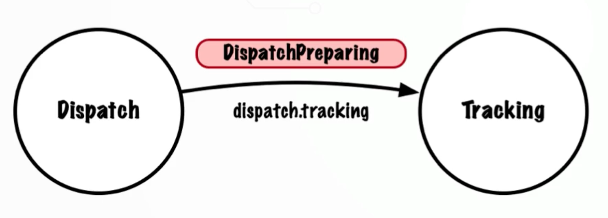
  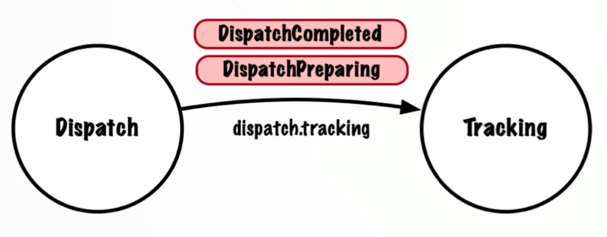

- Update Tracking Service:
  - Move `@KafkaListener` to class level
  - Use `@KafkaHandler` on the method
  - Remove default deserialisation type(기본 역직렬화 유형 제거)
  - Use type header with trusted packages

### Consumer Multiple Event Types Recap

- Updated DispatchTrackingHandler
  - `@KafkaHandler`
  - `@KafkaListener`
  - Updated TrackingConfiguration
    - Removed default deserialisation type
    - Configured trusted packages


# 12. Error Handling, Retry & Dead Letter Topic

## Section Introduction
---
### ErrorHandling: Retry & DLT
In this section...

- Exception categories
  - Not retryable exceptions(동일한 예외 재시도 하지 않음)
  - Retryable exceptions

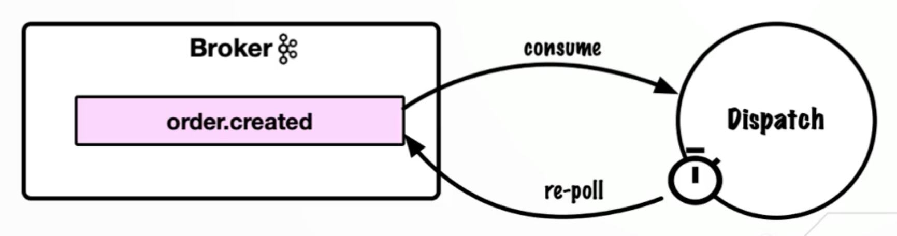

- Maximum retry attempts
- Dead Letter Topics (DLT)

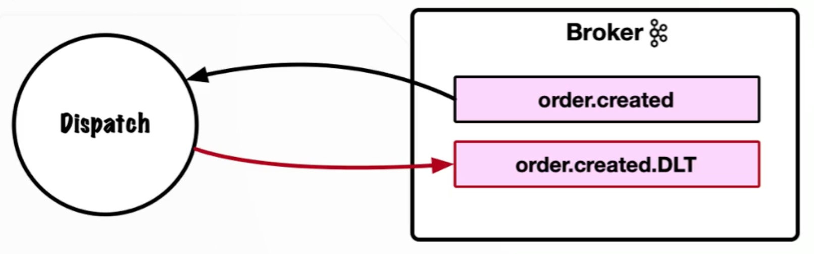

- Wiremock for testing


## Wiremock Overview
---
An introduction to Wiremock

- Library for stubbing a web service
- Specify response for given REST request
- Test with Spring Cloud Contract
- Run as a standalone service
- Facilitates component(구성 요소 테스트) / system testing(시스템 테스트)

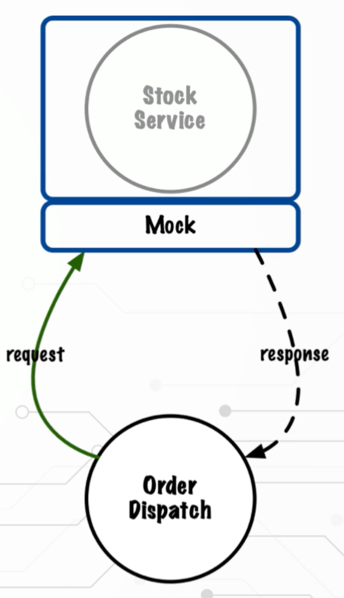


## Retry: Introduction
---
### Retry
Consumer retry behaviour

- External REST call to Stock Service
- Retry with Fixed Back Off

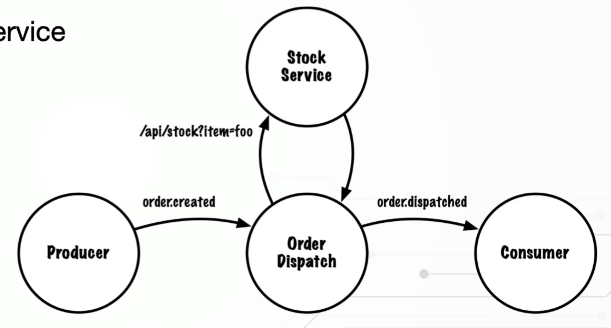

- Item availability check
- Exception handling - RetryableException

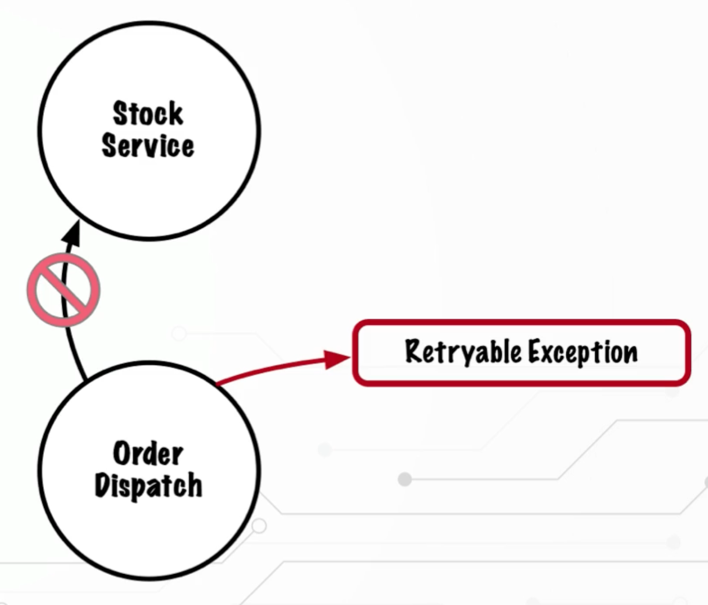

- Integration testing
- `@AutoConfigureWiremock` / `wiremock.server.port`

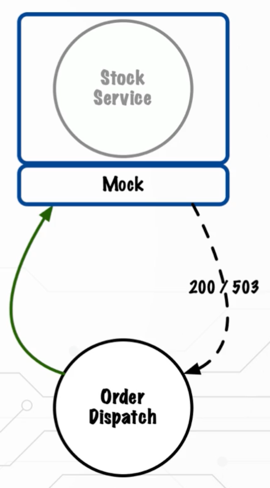

- Run end to end on the command line
- Standalone wiremock

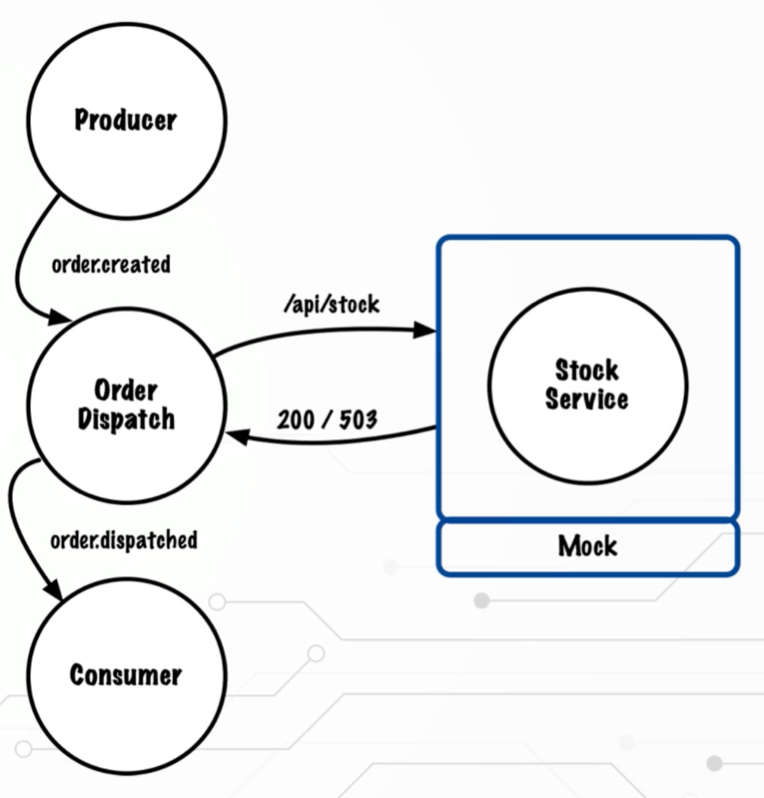


## Retry: Coding
---

### Retry: Coding & Unit Tests
Implementing retry with Spring Kafka

- Review code for Wiremock Call
- Implement retry with Spring Kafka
- Add code to call external service
- Update unit tests

## Retry: Integration Tests
---
Integration testing the retry behaviour

- Use Wiremock for tests
- Update happy path test
- Test not-retryable exception flow
- Test retryable exception flow


## Retry: Debugging Integration Test
---
Stepping through the integration tests with the IDE debugger

### Retry: Integration Test

- Use the IDE debugger to step through tests
- Add breakpoints at key points
- Observe the retry behaviour


## Retry: Command Line Demo
---
Running the end to end flow on the command line

- Run the standalone Wiremock
- Trigger different responses
- Observe the behaviour

Wiremock 설치 및 구동
```bash
$ git clone https://github.com/lydtechconsulting/introduction-to-kafka-wiremock
$ cd introduction-to-kafka-wiremock
$ curl https://repo1.maven.org/maven2/com/github/tomakehurst/wiremock-jre8-standalone/2.35.1/wiremock-jre8-standalone-2.35.1.jar > wiremock-jre8-standalone-2.35.1.jar
$ java -jar wiremock-jre8-standalone-2.35.1.jar --port 9001
```

kafka 서버 구동
```bash
$ bin/kafka-server-start.sh config/kraft/server.properties
```

Application 구동
```bash
$ mvn sprin-boot:run
```

Consumer 구동
```bash
$ bin/kafka-console-consumer.sh --topic order.dispatched --bootstrap-server localhost:9092 --property parse.key=true --property key.separator=:
```

Producer 구동
```bash
$ bin/kafka-console-producer.sh --topic order.created --bootstrap-server localhost:9092 --property parse.key=true --property key.separator=:
# 성공 처리
>"200":{"orderId": "124d5289-d51b-4a50-8e6f-df536384dfde","item":"item_200"}
# Bad Request 처리 재시도 초과로 실패처리
>"400":{"orderId": "9b1e8169-d64a-44ad-9b67-3fdec06aa040","item":"item_400"}
# Bad Gateway 재시도후 수신처리 
>"502":{"orderId": "930d6fa0-1520-4392-a042-b1b830021389","item":"item_502"}
```


## Retry: Recap
---
Summing up

- Added Fixed Back Off configuration
- Added external service REST call
- Updated integration tests
- Ran the standalone wiremock


## Dead Letter Topics
---
Sending events to the Dead Letter Topic

- Configure the dead letter topic
  - DeadLetterPublishing Recoverer
- Naming convention: `<original.topic>.DLT`
- Verify with integration tests


### Recap
Summing up

- Added DLT configuration
- Tested with integration tests
- Stepped through the code


## Section Recap
---
### Error Handling - Recap
How we retried messages and used the Dead Letter Topic

- Updated Dispatch Service to handle retryable and not retryable exceptions
- 재시도 가능 및 재시도 불가능 예외를 처리하도록 업데이트된 디스패치 서비스
- Configured retry
  - Max retry attempts
  - Interval between retries
- Utilised a Dead Letter Topic
- Integration tested with Spring Kafka Test
- Used Wiremock to force error conditions